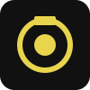

# 📸 CameraLab — Laboratorio Virtual de Fotografía

**Aprende fotografía *haciendo fotos*, no memorizando.** CameraLab es un laboratorio 3D, bilingüe y totalmente offline donde manipulas una cámara real (apertura, obturación, ISO, focal, distancia, enfoque) y ves al instante qué pasa con la luz, el movimiento y la profundidad.

> **100% estático · Sin registro · Sin backend · Funciona sin internet · No guarda datos personales**

<p align="center">
  
  <br/>
  <em>Una herramienta creativa, no un juego. Para clase, taller o autoaprendizaje.</em>
</p>

<p align="center">
  <a href="#-prueba-rápida"></a>
  <a href="https://github.com/nestorfernando3/camera-lab/actions"></a>
  <a href="https://github.com/nestorfernando3/camera-lab/actions/workflows/deploy-pages.yml"></a>
  
  
</p>

---

## ✨ ¡Hola! ¿Qué es CameraLab?

Imagina una cámara profesional simplificada, dentro del navegador. Mueves **un solo control a la vez**, capturas, comparas y recibes feedback que explica el **compromiso** que acabas de hacer (ej. “congelaste el movimiento pero subió el ruido”).

- 🎓 **Para estudiantes**: entiendes *por qué* una foto sale movida, oscura o con fondo borroso — experimentando.
- 👩‍🏫 **Para docentes**: 5 módulos progresivos, pizarra sin notas ni ranking, ideal para proyectar. Sin LMS, sin cuentas.
- 🤓 **Para curiosos**: sandbox libre + 3 retos de transferencia para jugar sin límite.

**No hay quizzes de opción múltiple, estrellas ni certificados.** El perfil final dice `Sólido / En desarrollo / Por explorar` por dominio — honesto y útil.

---

## 🚀 Prueba rápida (2 minutos)

**Online (recomendado):**
👉 **https://nestorfernando3.github.io/camera-lab/**  *(se genera tras el primer push a `main`)*

**Local:**
```bash
git clone https://github.com/nestorfernando3/camera-lab.git
cd camera-lab
npm ci              # instala todo (una vez)
npm run dev         # abre http://localhost:5173
```

Abre el navegador, elige **Comenzar → Currículo → M1.1 “Congelar al corredor”**, mueve la obturación a `1/1000`, **Capturar** y mira el feedback `Conseguiste / Observa / Compromiso`. ¡Ya estás aprendiendo!

---

## 🎯 ¿Qué vas a aprender?

| Módulo | Idea clave | Escena | Controles | “Aha!” |
|--------|------------|--------|-----------|--------|
| **M1 · Movimiento** | obturación = tiempo de registro | runner 🏃 | obturación → +ISO → +apertura | *congelar cuesta luz* |
| **M2 · Apertura** | apertura = luz + profundidad | portrait 🧑 | apertura → +ISO | *f/1.4 desenfoca fondo, f/11 lo mantiene nítido* |
| **M3 · ISO y tonos** | ISO = amplificación con ruido | portrait | ISO → apertura+ISO → obturación+apertura+ISO | *subir ISO salva exposición pero añade grano* |
| **M4 · Exposición como sistema** | stops equivalentes | runner/portrait | apertura+obturación → todos | *misma luz, fotos distintas* |
| **M5 · Óptica y espacio** | focal, distancia y enfoque | portrait/depth 🔍 | focal → focal+distancia → apertura+focal+enfoque | *misma pose, fondo distinto* |

**+ Sandbox libre** (todos los controles + 5 presets: *Congelar / Retrato suave / Foco profundo / Poca luz / Barrido*) y **3 retos de transferencia** (retrato editorial, corredor al anochecer, panning con follow 0.8).

Cada misión acepta **múltiples soluciones válidas** — solo importan las métricas de resultado (blur, exposición, ruido, FOV), no una configuración “correcta”.

---

## 🧩 Cómo se ve una misión

```
brief → eliges tu primera configuración (predicción) → exploras → Capturar → feedback → repetir o avanzar
```

- **Capturas**: `1` (solo actual) → `2` (A/B guiada, resalta Δ) → `3` → `5` (reto avanzado). Intentos ilimitados.
- **Pistas** (3 niveles, nunca dan el valor exacto al inicio):
  1. *“Mira el rastro de movimiento”* → 2. *“Controla con obturación”* → 3. *“Prueba un denominador mayor”*
- **Feedback** siempre en 3 bloques: **Conseguiste / Observa / Compromiso** — explica *qué ganaste y qué sacrificaste*.

---

## 🖥️ Requisitos

- **Desktop / laptop** (mínimo `1024 × 700`). En móvil/tablet <768px verás un aviso amable — no es objetivo de v1.
- Navegador moderno (Chrome, Firefox, Edge, Safari). Sin instalación extra.

---

## 🛠️ Para desarrolladores

### Stack rápido
`React 19 + TS 5 + Vite 8` · `Three.js + React Three Fiber + drei` (escenas procedurales, sin GLB) · `Zustand` · `i18next` · `Vitest + Playwright` · `vite-plugin-pwa`

### Estructura mental
```
src/domain/camera/   → física pura y determinista (testeable sin WebGL)
src/domain/learning/ → misiones, evaluación, hints, mastery
src/content/         → 15 misiones + 3 retos, presets, locales es/en
src/scenes/          → SceneCanvas + 3 escenas (runner, portrait, depth)
src/features/lab/    → controles progresivos + captura + comparación + feedback
src/features/capture/→ histograma 64 bins + export PNG con footer
src/features/progress/→ localStorage + IndexedDB local
src/app/             → SPA con hash (#lab/mision) — evita 404 en Pages
```

### Comandos

```bash
npm ci                # instala exacto (usa package-lock.json)
npm run dev           # dev en 5173 con HMR
npm run typecheck     # tsc -b
npm run lint          # eslint . (pasa en CI)
npm run test          # vitest watch
npm run test:run      # vitest run (CI)
npm run test:e2e      # playwright (requiere npx playwright install chromium)
npm run build         # tsc -b && vite build → dist/
npm run preview       # sirve dist en 4173
npm run verify        # lint + typecheck + test:run + build (gate de release)
```

### Testing
- **Unitario**: `src/domain/camera/*`, `evaluateMission`, `mastery`, `histogram`, `locales parity`, `sceneRegistry` → `npm run test:run` (40 tests)
- **E2E**: navegación libre, misión shutter→metrics→capture→feedback, persistencia tras reload, base path Pages → `npm run test:e2e`

### Build para GitHub Pages

```bash
# Local (/)
npm run build

# Pages (project site /camera-lab/)
VITE_BASE_PATH=/camera-lab/ npm run build
# → dist/index.html referencia /camera-lab/assets/…
```

El workflow [deploy-pages.yml](.github/workflows/deploy-pages.yml) hace esto automático en cada push a `main`.

---

## 🌐 Despliegue en GitHub Pages (tu propio fork)

1. Fork → `Settings → Pages → Source → GitHub Actions` (una vez)
2. `git push origin main` → Action **Deploy CameraLab** construye con `VITE_BASE_PATH=/<repo>/` y publica `dist/`
3. URL: `https://<tu-usuario>.github.io/camera-lab/`

¿Dominio propio? `VITE_BASE_PATH=/ npm run build` — sin tocar código.

---

## 📴 Offline y privacidad

- **PWA**: tras primera visita, Workbox precachea JS/CSS/icons (~1.1 MiB). Desconecta internet, recarga y todo sigue funcionando: escenas, controles, evaluación, progreso.
- **Local only**:
  - Progreso → `localStorage cameralab:v1:progress` (v1)
  - Telemetría → `IndexedDB cameralab/learning-events` (anónima: settings, métricas, hints; sin nombre/email/IP)
  - Exportas telemetría **solo** pulsando *Exportar datos de aprendizaje* → descarga `cameralab-telemetry.json`
  - PNG exportado opcional con footer `f/… 1/… ISO… mm` — sin identidad, solo descarga local

---

## 📚 Documentación

- [Arquitectura](docs/architecture.md) — SPA estática, flujo `simulateCapture`, escenas, estado, PWA
- [Pedagogía](docs/pedagogy.md) — principios, máquina de flujo, 5 módulos, evaluación, mastery
- [Modelo de simulación](docs/simulation-model.md) — fórmulas EV100, FOV, DOF thin-lens, motion blur, ruido ISO y simplificaciones

---

## 🙋 FAQ rápido

**¿Necesito cuenta?** No. Cero registro.

**¿Guarda mis fotos?** No hay portfolio interno. Solo descargas PNG locales si tú pulsas exportar.

**¿Por qué no hay nota?** CameraLab valora decisiones con compromiso, no respuestas únicas. El perfil `Sólido / En desarrollo / Por explorar` es más honesto.

**¿Puedo saltarme módulos?** Sí, siempre. Verás una notita no bloqueante si te adelantas.

**¿Histograma?** Aparece solo tras capturar, y es opcional. No es requisito para principiantes.

**¿Sonido?** Click sintetizado con Web Audio, desactivable. Nunca es obligatorio.

---

## 🤝 Contribuir

¡Bienvenido! Abre issue o PR. Antes de enviar:

```bash
npm run verify           # debe pasar
VITE_BASE_PATH=/camera-lab/ npm run build
# revisa: no `fetch(`, no `https://` en src/ (offline-first)
```

**Scope v1**: no backend, no Supabase/Firebase, no login, no cloud sync, no dashboard docente, no LMS, no IA remota, no RAW/balance de blancos/flash/IBIS, no zoom continuo, no UX móvil dedicada, no portfolio, no certificados/leaderboards, no analytics remoto, no fuentes/3D remotos.

---

## 📄 Licencia

MIT — haz lo que quieras, aprende mucho.

---

<p align="center">
  <strong>Hecho con 📷, Three.js y paciencia pedagógica.</strong><br/>
  <code>CameraLab v1.0.0</code> · <a href="https://nestorfernando3.github.io/camera-lab/">Abrir app</a> · <a href="docs/architecture.md">Docs</a>
</p>
